# System Architecture Diagrams
# Personalized Agentic Voice Assistant

This document contains all Mermaid diagrams for system architecture, data flow, and user journeys.

---

## Table of Contents

1. [System Architecture](#1-system-architecture)
2. [Data Flow Diagrams](#2-data-flow-diagrams)
3. [User Journeys](#3-user-journeys)
4. [Component Diagrams](#4-component-diagrams)
5. [Deployment Architecture](#5-deployment-architecture)

---

## 1. System Architecture

### 1.1 High-Level Architecture

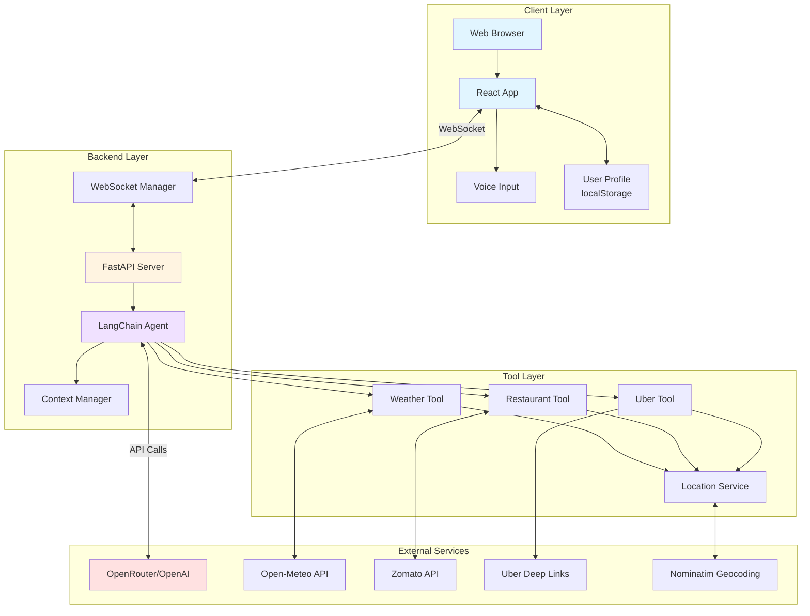

### 1.2 Component Architecture

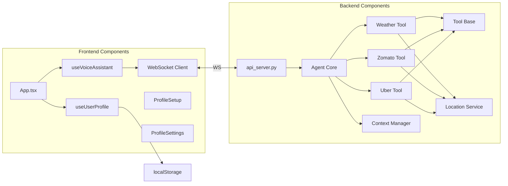

---

## 2. Data Flow Diagrams

### 2.1 Complete Message Flow

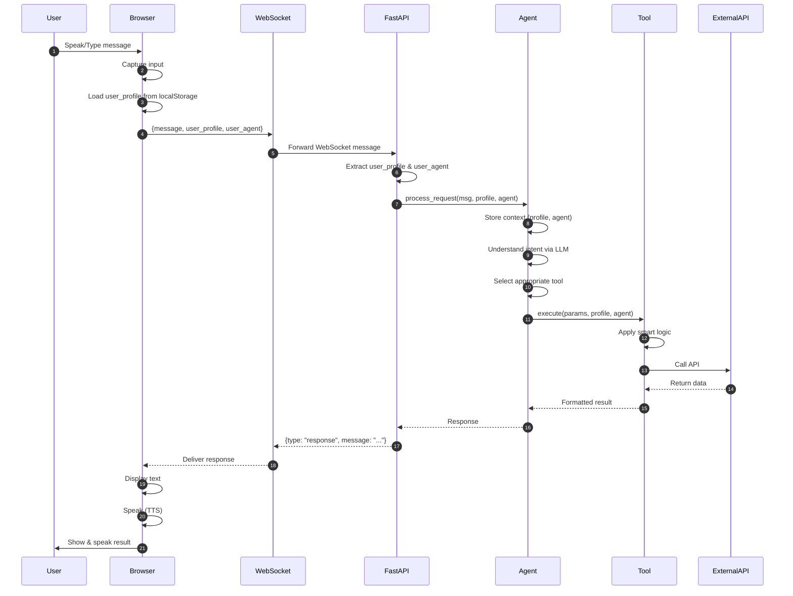

### 2.2 Profile Data Flow

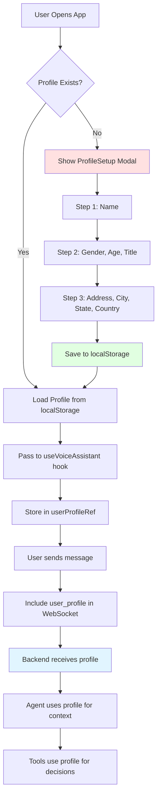

### 2.3 Uber Smart Pickup Flow

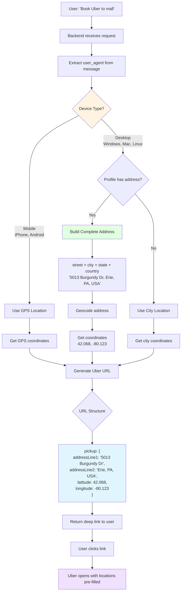

---

## 3. User Journeys

### 3.1 First-Time User Journey


### 3.2 Weather Check Journey

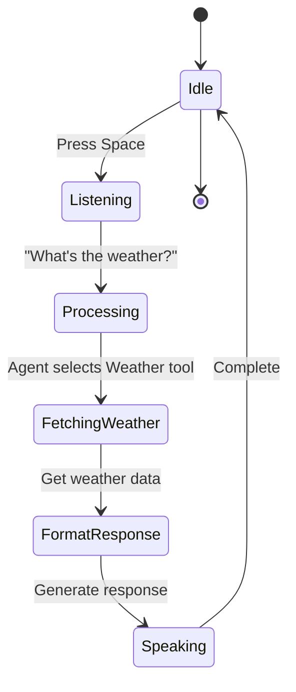

### 3.3 Uber Booking Journey (Desktop)

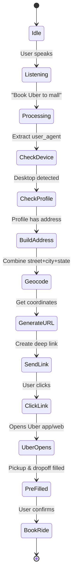

---

## 4. Component Diagrams

### 4.1 Frontend Component Tree

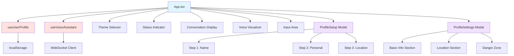

### 4.2 Backend Tool Architecture

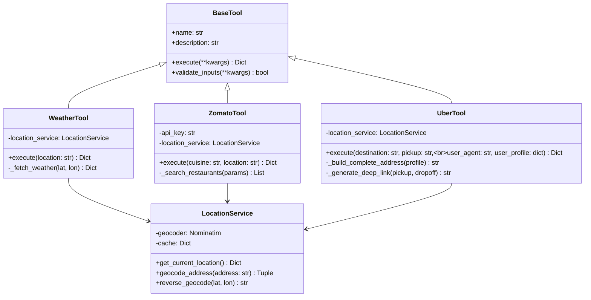

### 4.3 Agent Decision Flow

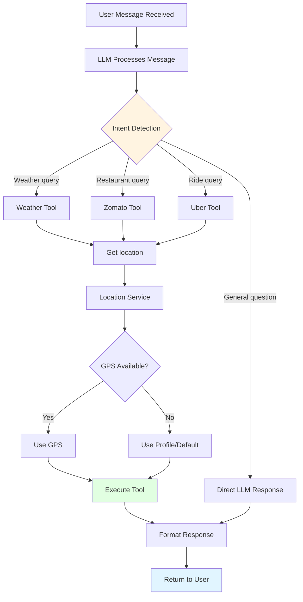

---

## 5. Deployment Architecture

### 5.1 Development Environment

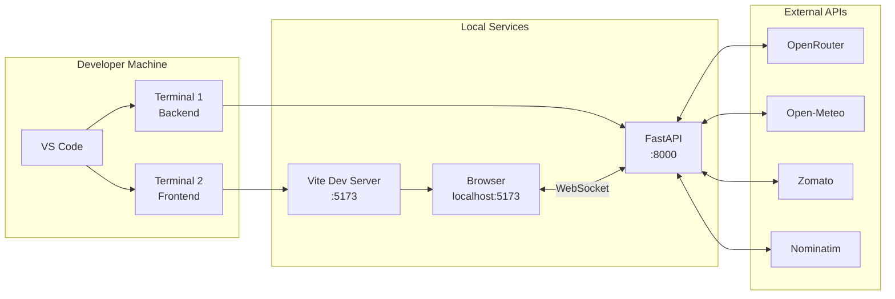

### 5.2 Production Deployment (Future)

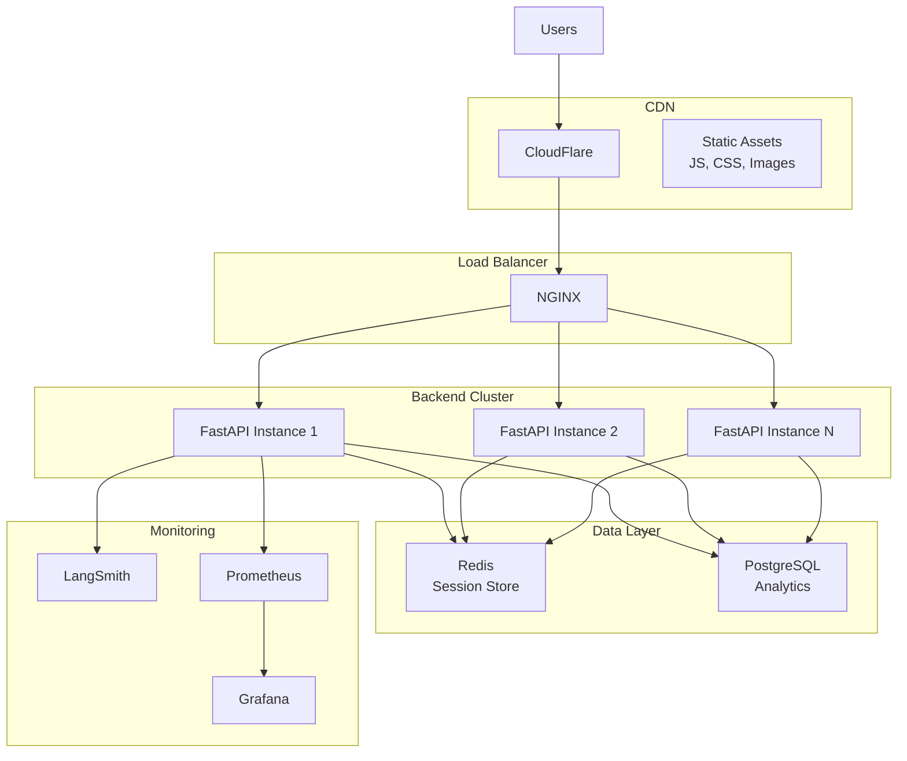

### 5.3 Data Flow in Production

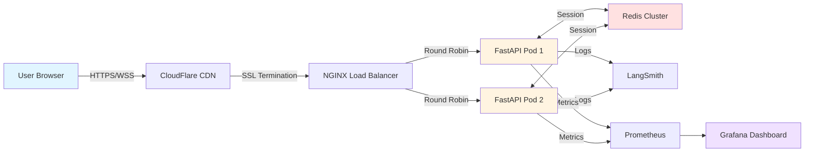

---

## 6. State Diagrams

### 6.1 Application State

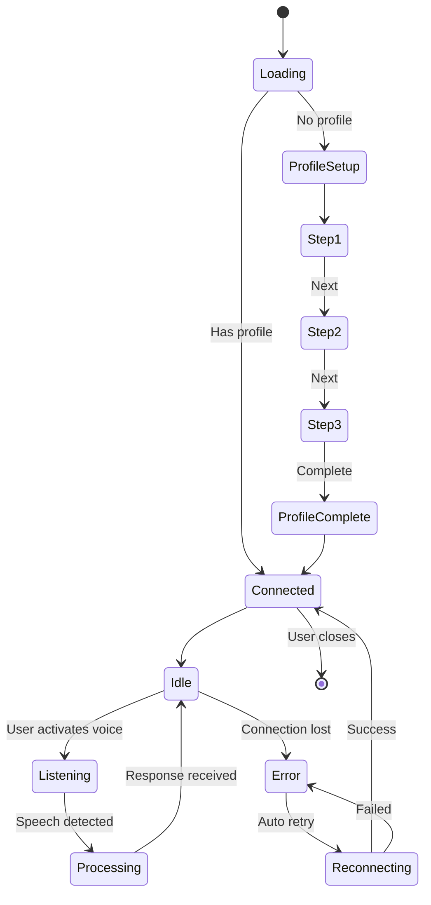

### 6.2 WebSocket Connection State

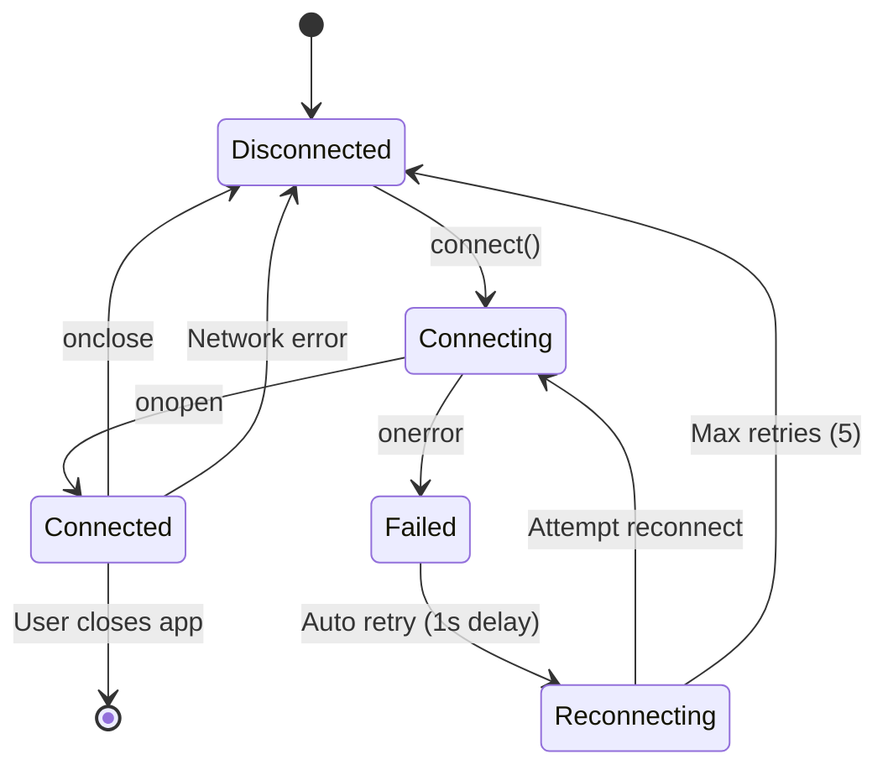

---

## 7. Entity Relationship

### 7.1 User Profile Data Model

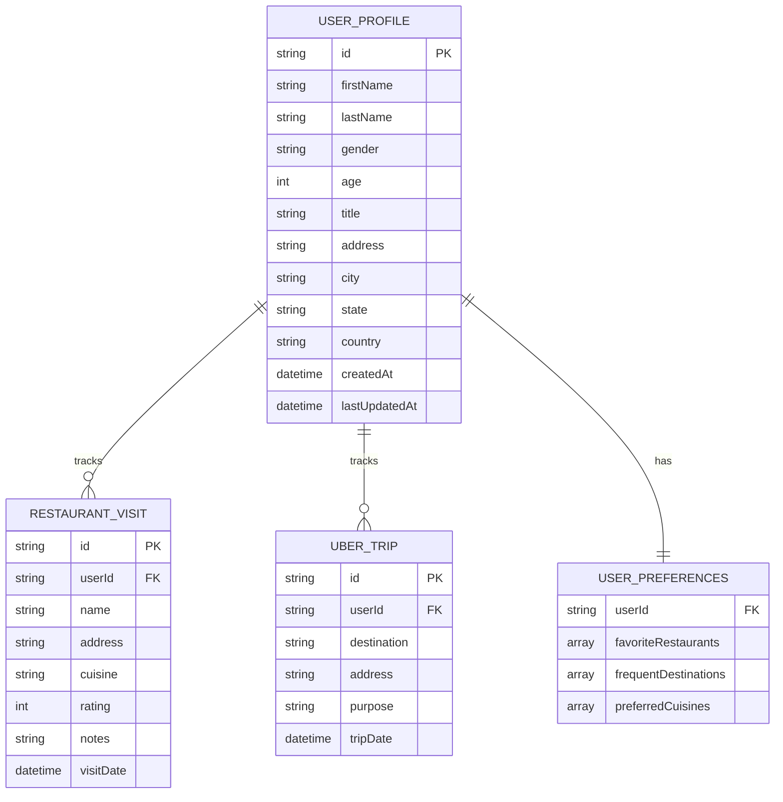

---

## 8. Sequence Diagrams

### 8.1 Profile Setup Flow

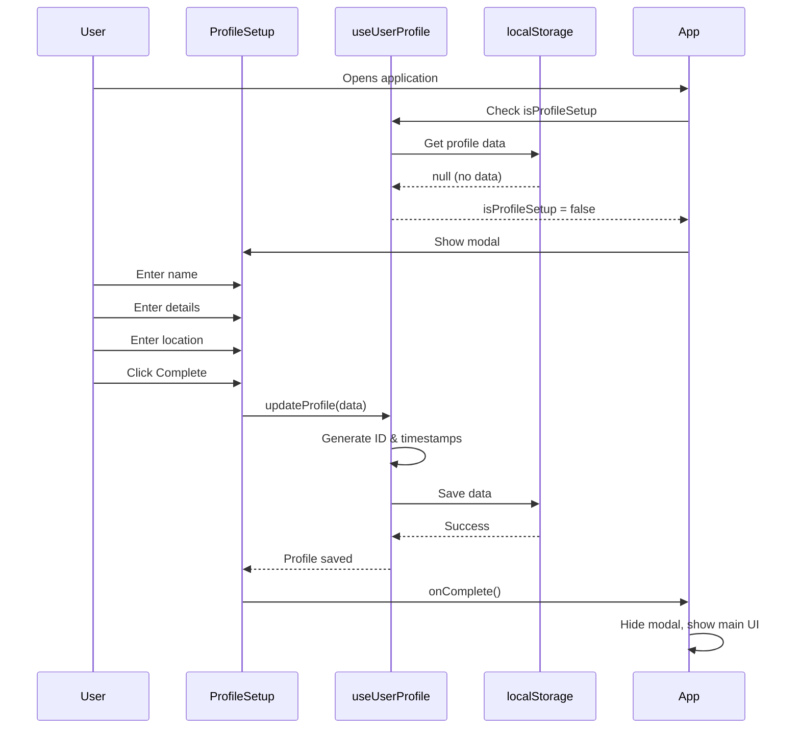

### 8.2 Error Handling Flow

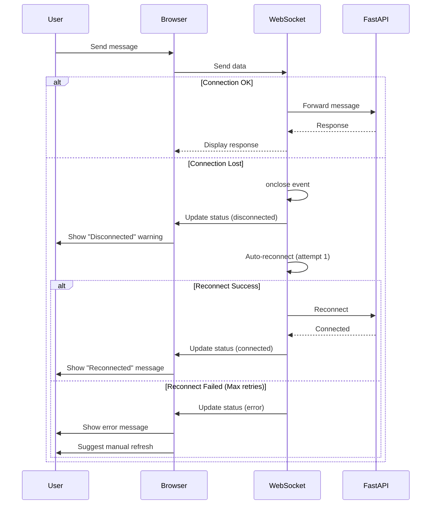

---

## 9. Activity Diagrams

### 9.1 Voice Interaction Flow

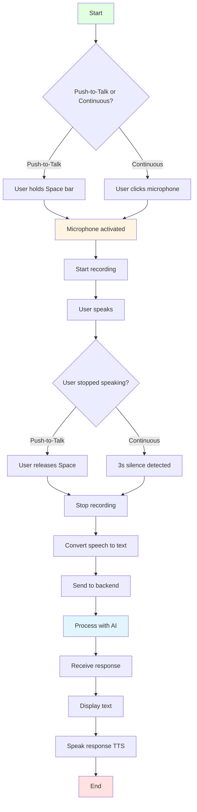

---

## 10. Network Architecture

### 10.1 Communication Protocols

```mermaid
graph LR
    subgraph "Frontend"
        A[React App<br/>:5173]
    end
    
    subgraph "Backend"
        B[FastAPI<br/>:8000]
    end
    
    subgraph "External"
        C[OpenRouter<br/>HTTPS]
        D[Open-Meteo<br/>HTTPS]
        E[Zomato<br/>HTTPS]
        F[Nominatim<br/>HTTPS]
    end
    
    A <-->|WebSocket<br/>ws://localhost:8000/ws/{id}| B
    B <-->|HTTPS POST<br/>Authorization: Bearer| C
    B <-->|HTTPS GET| D
    B <-->|HTTPS GET<br/>user-key header| E
    B <-->|HTTPS GET| F
    
    style A fill:#e1f5ff
    style B fill:#fff4e1
    style C fill:#ffe1e1
```

---

## Legend

```mermaid
graph LR
    A[Frontend<br/>Components] 
    B[Backend<br/>Services]
    C[External<br/>APIs]
    D[Data<br/>Storage]
    
    style A fill:#e1f5ff
    style B fill:#fff4e1
    style C fill:#ffe1e1
    style D fill:#f0e1ff
```

- **Blue (#e1f5ff)**: Frontend components
- **Yellow (#fff4e1)**: Backend services
- **Red (#ffe1e1)**: External APIs / Data storage
- **Purple (#f0e1ff)**: Data models / Results

---

**Document Version:** 1.0.0  
**Last Updated:** March 7, 2026  
**Tools Used:** Mermaid.js

To render these diagrams:
1. Use Mermaid Live Editor: https://mermaid.live
2. Use Mermaid extension in VS Code
3. Use Mermaid plugin in documentation sites (GitBook, Docusaurus, etc.)
