# System Architecture Diagrams — Personalized Agentic Voice Assistant v2.0

This document contains all Mermaid diagrams for system architecture, data flow, and user journeys.

---

## Table of Contents

1. [System Architecture](#1-system-architecture)
2. [Data Flow Diagrams](#2-data-flow-diagrams)
3. [User Journeys](#3-user-journeys)
4. [Component Diagrams](#4-component-diagrams)
5. [Deployment Architecture](#5-deployment-architecture)
6. [State Diagrams](#6-state-diagrams)
7. [Entity Relationship](#7-entity-relationship)
8. [Sequence Diagrams](#8-sequence-diagrams)
9. [Activity Diagrams](#9-activity-diagrams)
10. [Network Architecture](#10-network-architecture)

---

## 1. System Architecture

### 1.1 High-Level Architecture

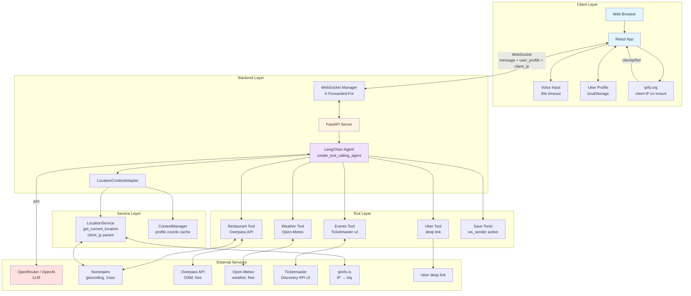

### 1.2 Location Resolution Priority Chain

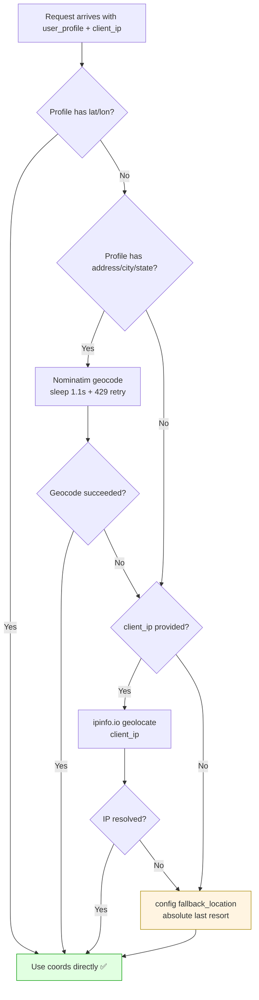

### 1.3 Component Architecture

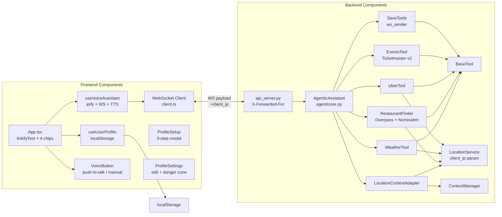

---

## 2. Data Flow Diagrams

### 2.1 Complete Message Flow

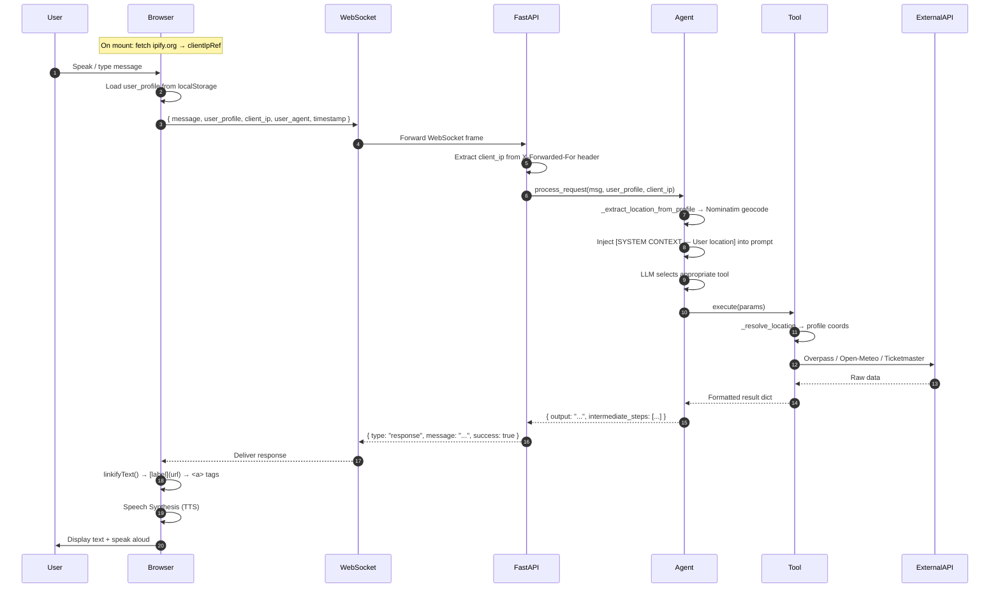

### 2.2 Client IP Pipeline

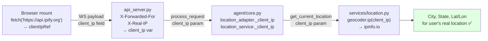

### 2.3 Profile Data Flow

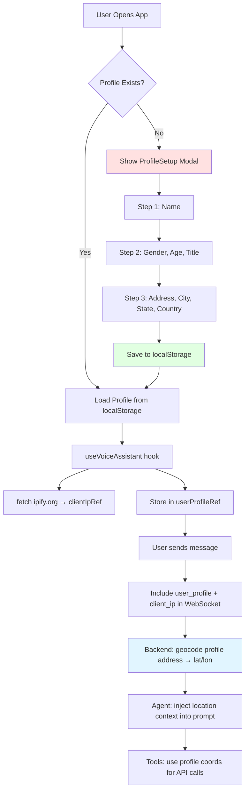

### 2.4 Uber Smart Pickup Flow

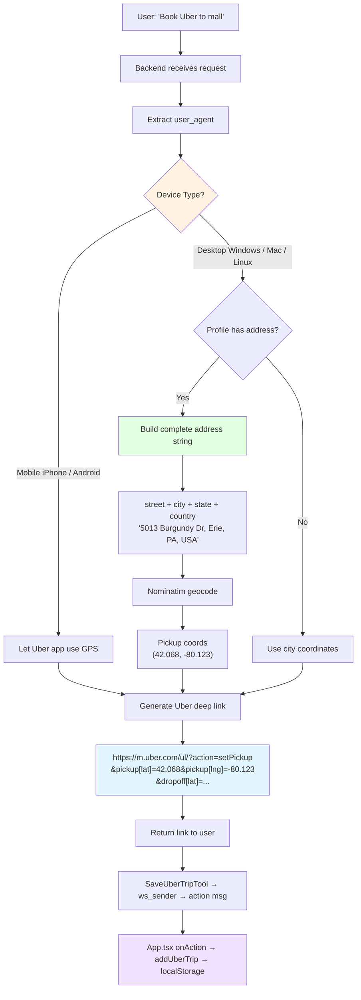

### 2.5 Events Discovery Flow

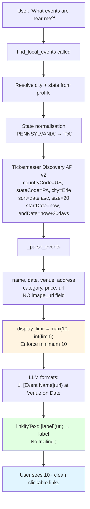

---

## 3. User Journeys

### 3.1 First-Time User Journey

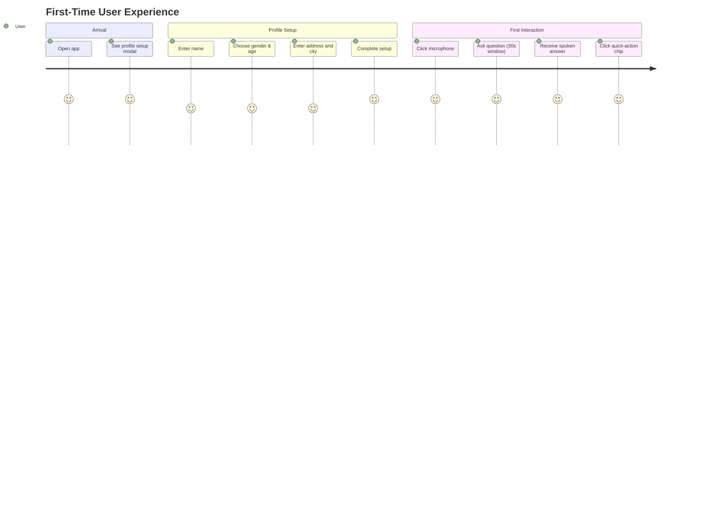

### 3.2 Weather Check Journey

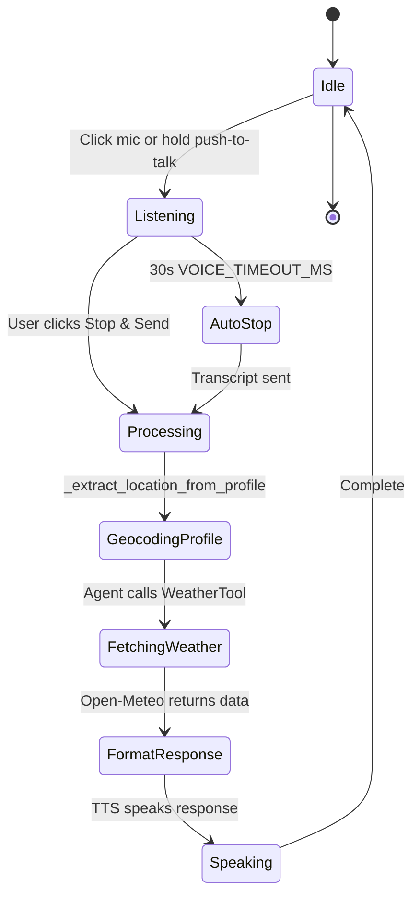

### 3.3 Restaurant Search Journey

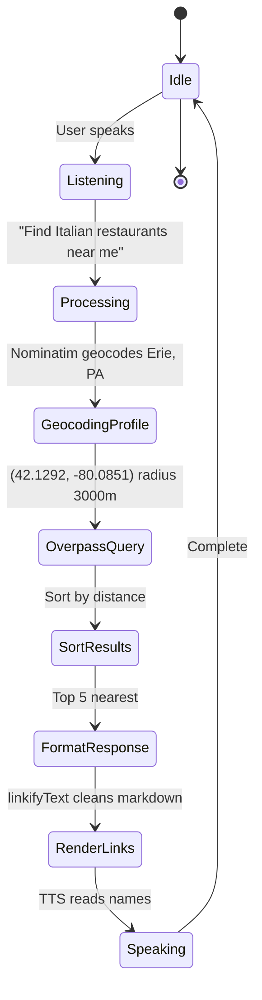

---

## 4. Component Diagrams

### 4.1 Frontend Component Tree

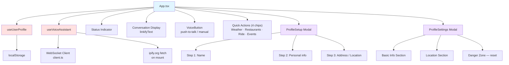

### 4.2 Backend Tool Architecture

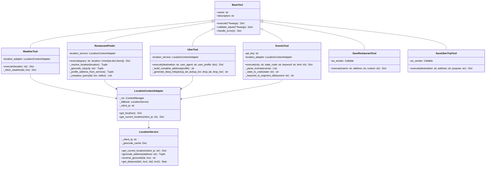

### 4.3 Agent Decision Flow

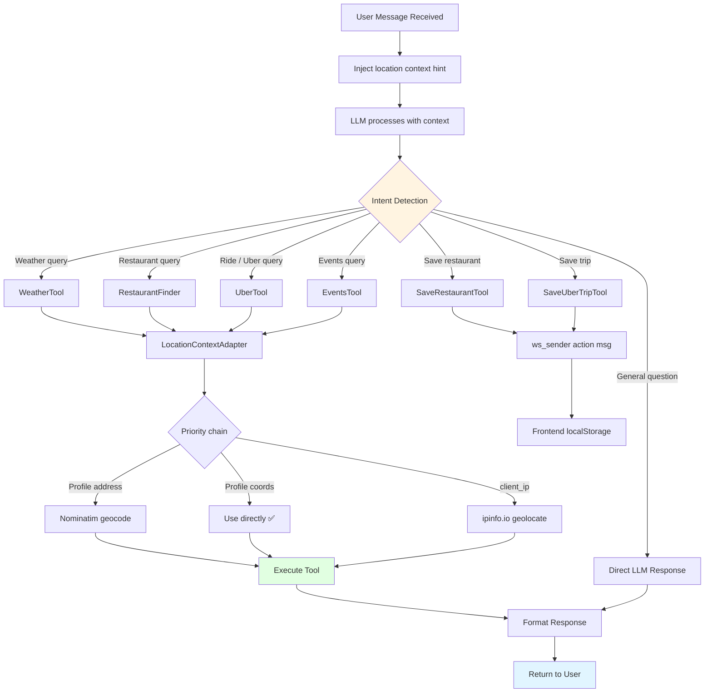

---

## 5. Deployment Architecture

### 5.1 Development Environment

```mermaid
graph LR
    subgraph "Developer Machine"
        A[VS Code]
        B[Terminal 1<br/>python api_server.py]
        C[Terminal 2<br/>npm run dev]
    end

    subgraph "Local Services"
        D[FastAPI<br/>:8000]
        E[Vite Dev Server<br/>:5173]
        F[Browser<br/>localhost:5173]
    end

    subgraph "External APIs"
        G[OpenRouter / OpenAI]
        H[Open-Meteo]
        I[Overpass API]
        J[Nominatim]
        K[Ticketmaster]
        L[ipify.org / ipinfo.io]
    end

    A --> B
    A --> C
    B --> D
    C --> E
    E --> F
    F <-->|ws://localhost:8000/ws/{id}| D
    D <--> G
    D <--> H
    D <--> I
    D <--> J
    D <--> K
    F <-->|HTTPS| L
```

### 5.2 Production Deployment (Render)

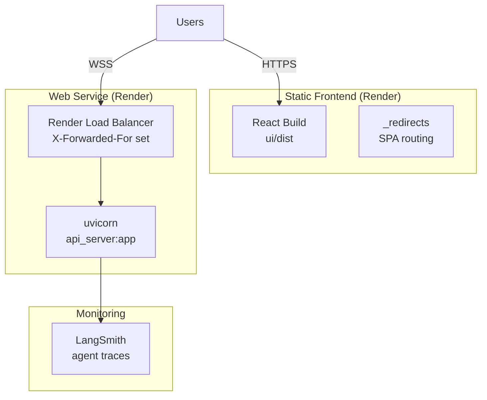

### 5.3 Nginx Self-Hosted

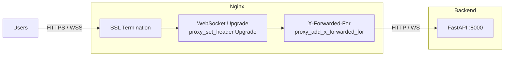

### 5.4 Data Flow in Production

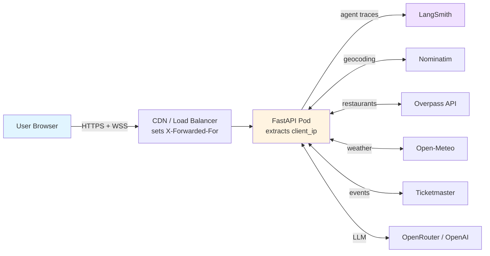

---

## 6. State Diagrams

### 6.1 Application State

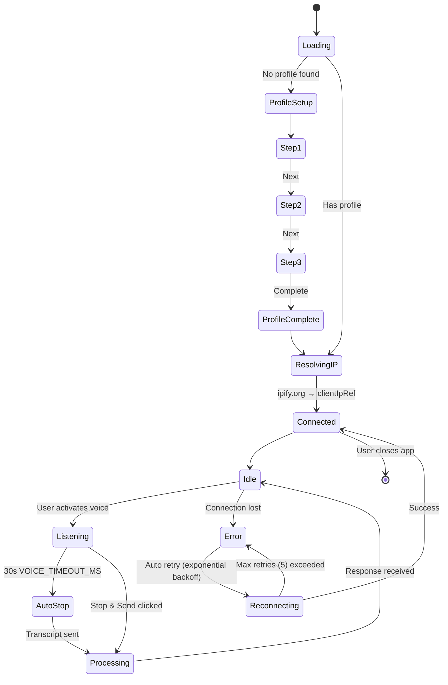

### 6.2 WebSocket Connection State

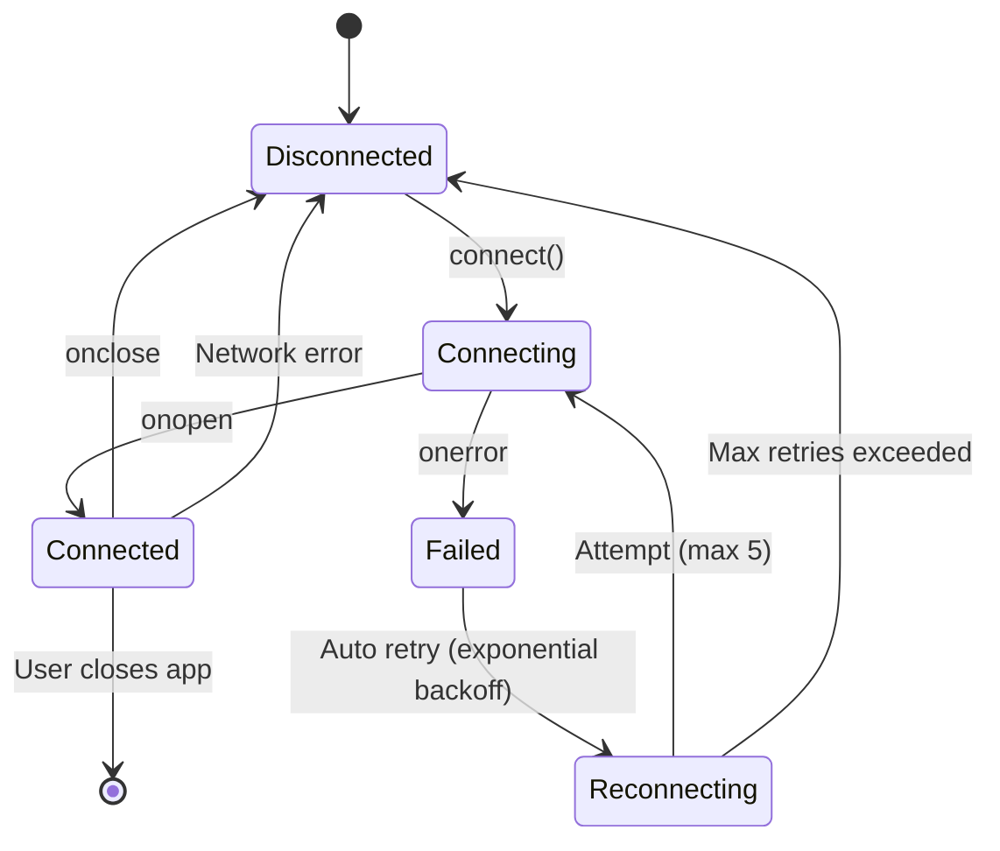

### 6.3 Voice Recording State

```mermaid
stateDiagram-v2
    [*] --> Idle
    Idle --> PushToTalk: User holds mic button
    Idle --> ManualMode: User clicks mic
    PushToTalk --> Recording: pointerdown
    ManualMode --> Recording: click
    Recording --> Stopped: User releases (push-to-talk)
    Recording --> Stopped: User clicks Stop & Send
    Recording --> AutoStopped: VOICE_TIMEOUT_MS = 30s
    Stopped --> Sending: Transcript ready
    AutoStopped --> Sending: Transcript ready
    Sending --> Idle: Message dispatched
    Recording --> Error: Mic permission denied
    Error --> Idle: User resolves
```

---

## 7. Entity Relationship

### 7.1 User Profile Data Model

```mermaid
erDiagram
    USER_PROFILE ||--o{ RESTAURANT_VISIT : tracks
    USER_PROFILE ||--o{ UBER_TRIP : tracks
    USER_PROFILE ||--|| USER_PREFERENCES : has

    USER_PROFILE {
        string id PK
        string firstName
        string lastName
        string gender
        int age
        string title
        string address
        string city
        string state
        string country
        datetime createdAt
        datetime lastUpdatedAt
    }

    USER_PREFERENCES {
        string userId FK
        array favoriteRestaurants
        array frequentDestinations
        array preferredCuisines
    }

    RESTAURANT_VISIT {
        string id PK
        string userId FK
        string name
        string address
        string cuisine
        int rating
        string notes
        datetime visitDate
    }

    UBER_TRIP {
        string id PK
        string userId FK
        string destination
        string address
        string purpose
        datetime tripDate
    }
```

---

## 8. Sequence Diagrams

### 8.1 Profile Setup Flow

```mermaid
sequenceDiagram
    participant User
    participant ProfileSetup
    participant useUserProfile
    participant localStorage
    participant App

    User->>App: Opens application
    App->>useUserProfile: Check isProfileSetup
    useUserProfile->>localStorage: Get profile data
    localStorage-->>useUserProfile: null
    useUserProfile-->>App: isProfileSetup = false
    App->>ProfileSetup: Show 3-step modal

    User->>ProfileSetup: Step 1 — enter name
    User->>ProfileSetup: Step 2 — personal info
    User->>ProfileSetup: Step 3 — address / city / state
    User->>ProfileSetup: Click Complete

    ProfileSetup->>useUserProfile: updateProfile(data)
    useUserProfile->>useUserProfile: Generate ID & timestamps
    useUserProfile->>localStorage: Save profile
    localStorage-->>useUserProfile: Success
    useUserProfile-->>ProfileSetup: Saved
    ProfileSetup->>App: onComplete()
    App->>App: Hide modal; fetch ipify.org → clientIpRef
    App->>App: Show main chat UI
```

### 8.2 Location Resolution Sequence

```mermaid
sequenceDiagram
    participant Browser
    participant FastAPI
    participant CorePy as agent/core.py
    participant Nominatim
    participant Tool
    participant Overpass

    Browser->>FastAPI: WS { user_profile: {city:"Erie", state:"PENNSYLVANIA"}, client_ip:"24.x.x.x" }
    FastAPI->>CorePy: process_request(msg, user_profile, client_ip="24.x.x.x")
    CorePy->>CorePy: location_adapter._client_ip = "24.x.x.x"
    CorePy->>CorePy: _extract_location_from_profile
    CorePy->>CorePy: sleep(1.1s)
    CorePy->>Nominatim: geocode("Erie, PENNSYLVANIA")
    Nominatim-->>CorePy: (42.1292, -80.0851)
    CorePy->>CorePy: context_manager.set_location(lat=42.1292, lon=-80.0851)
    CorePy->>CorePy: Inject "[SYSTEM CONTEXT — User location: Erie, PA]"
    CorePy->>Tool: search_restaurants(query="restaurant")
    Tool->>Tool: _resolve_location → ctx.get_location()
    Tool->>Overpass: query centred on (42.1292, -80.0851)
    Overpass-->>Tool: Restaurants in Erie, PA ✅
    Tool-->>CorePy: { success: true, restaurants: [...] }
    CorePy-->>FastAPI: response message
    FastAPI-->>Browser: { type: "response", message: "..." }
```

### 8.3 Error Handling Flow

```mermaid
sequenceDiagram
    participant User
    participant Browser
    participant WebSocket
    participant FastAPI

    User->>Browser: Send message
    Browser->>WebSocket: Send data

    alt Connection OK
        WebSocket->>FastAPI: Forward message
        FastAPI-->>WebSocket: Response
        WebSocket-->>Browser: Display response
    else Connection Lost
        WebSocket->>WebSocket: onerror / onclose
        WebSocket->>Browser: Update status (disconnected)
        Browser->>User: Show "Disconnected" warning
        loop Exponential backoff (max 5 attempts)
            WebSocket->>WebSocket: delay doubles each retry
            WebSocket->>FastAPI: Reconnect attempt
            alt Reconnect Success
                FastAPI-->>WebSocket: Connected
                WebSocket->>Browser: Update status (connected)
                Browser->>User: Show "Reconnected"
            else Still Failing
                WebSocket->>WebSocket: Increment retry count
            end
        end
        WebSocket->>Browser: Max retries — show error
        Browser->>User: Suggest manual refresh
    end
```

### 8.4 Nominatim 429 Retry Sequence

```mermaid
sequenceDiagram
    participant Tool as RestaurantFinder
    participant Nominatim

    Tool->>Tool: attempt 0 — sleep(1.1s)
    Tool->>Nominatim: geocode("Erie, PA")
    Nominatim-->>Tool: HTTP 429

    Tool->>Tool: sleep(2s backoff)
    Tool->>Tool: attempt 1 — sleep(2.2s)
    Tool->>Nominatim: geocode("Erie, PA")
    Nominatim-->>Tool: HTTP 429

    Tool->>Tool: sleep(4s backoff)
    Tool->>Tool: attempt 2 — sleep(3.3s)
    Tool->>Nominatim: geocode("Erie, PA")
    Nominatim-->>Tool: (42.1292, -80.0851) ✅
```

---

## 9. Activity Diagrams

### 9.1 Voice Interaction Flow

```mermaid
flowchart TD
    A[Start] --> B{Interaction Mode?}
    B -->|Push-to-talk| C[User holds mic button]
    B -->|Manual stop| D[User clicks mic]

    C --> E[Microphone activated]
    D --> E

    E --> F[Web Speech API starts recording]
    F --> G[User speaks]
    G --> H{Stop trigger?}

    H -->|Push-to-talk| I[User releases button]
    H -->|Manual| J[User clicks Stop & Send]
    H -->|Auto| K[VOICE_TIMEOUT_MS = 30s elapsed]

    I --> L[Stop recording]
    J --> L
    K --> L

    L --> M[SpeechRecognition transcript]
    M --> N[sendMessage with profile + client_ip]
    N --> O[Backend processes with LangChain agent]
    O --> P[Receive response over WebSocket]
    P --> Q[linkifyText → render <a> tags]
    Q --> R[Display in chat bubble]
    R --> S[Speech Synthesis TTS]
    S --> T[End]

    style A fill:#e1ffe1
    style E fill:#fff4e1
    style O fill:#e1f5ff
    style T fill:#ffe1e1
```

### 9.2 Events Tool Activity

```mermaid
flowchart TD
    A["find_local_events called"] --> B[Get city + state from profile]
    B --> C["_state_to_code('PENNSYLVANIA') → 'PA'"]
    C --> D{Keyword provided?}
    D -->|Yes| E["_keyword_to_segment_id(keyword)\ne.g. 'concert' → KZFzniwnSyZfZ7v7nJ"]
    D -->|No| F[No segment filter]
    E --> G[Build Ticketmaster API URL]
    F --> G
    G --> H["startDateTime = now UTC\nendDateTime = now + 30 days"]
    H --> I["GET /discovery/v2/events\n?countryCode=US&stateCode=PA&city=Erie\n&sort=date,asc&size=20"]
    I --> J{Response OK?}
    J -->|No| K[Return error dict]
    J -->|Yes| L["_parse_events()\nname, date, venue, address\ncategory, price, url\nNO image_url"]
    L --> M["display_limit = max(10, int(limit))\n← floor prevents LLM passing limit=5"]
    M --> N[Return top display_limit events]
    N --> O[LLM formats as markdown links]
    O --> P["linkifyText: [name](url) → <a> tag"]

    style M fill:#fff4e1
    style P fill:#e1ffe1
```

---

## 10. Network Architecture

### 10.1 Communication Protocols

```mermaid
graph LR
    subgraph "Frontend"
        A[React App<br/>:5173]
    end

    subgraph "Backend"
        B[FastAPI<br/>:8000]
    end

    subgraph "External"
        C[OpenRouter<br/>HTTPS]
        D[Open-Meteo<br/>HTTPS]
        E[Overpass API<br/>HTTPS]
        F[Nominatim<br/>HTTPS]
        G[Ticketmaster<br/>HTTPS]
        H[ipify.org<br/>HTTPS — browser]
        I[ipinfo.io<br/>HTTPS — backend]
    end

    A <-->|"WebSocket\nws://localhost:8000/ws/{id}\nPayload: {message, user_profile, client_ip, user_agent}"| B
    B <-->|"HTTPS POST\nAuthorization: Bearer"| C
    B <-->|HTTPS GET| D
    B <-->|HTTPS GET| E
    B <-->|"HTTPS GET\n1 req/sec max"| F
    B <-->|"HTTPS GET\nApikey header"| G
    A <-->|"HTTPS GET\nformat=json"| H
    B <-->|"HTTPS GET\n/client_ip/json"| I

    style A fill:#e1f5ff
    style B fill:#fff4e1
    style C fill:#ffe1e1
```

### 10.2 WebSocket Message Types

```mermaid
flowchart LR
    subgraph "Client → Server"
        A["{ type: 'chat',\n  message: '...',\n  user_profile: {...},\n  client_ip: '24.x.x.x',\n  user_agent: '...',\n  timestamp: ... }"]
    end

    subgraph "Server → Client"
        B["{ type: 'response',\n  message: '...',\n  success: true }"]
        C["{ type: 'action',\n  action: 'save_restaurant',\n  data: { name, address, ... } }"]
        D["{ type: 'error',\n  message: '...' }"]
        E["{ type: 'status',\n  message: 'Processing...' }"]
    end

    A --> B
    A --> C
    A --> D
    A --> E
```

---

## Legend

```mermaid
graph LR
    A[Frontend<br/>Components]
    B[Backend<br/>Services]
    C[External<br/>APIs]
    D[Data<br/>Storage]

    style A fill:#e1f5ff
    style B fill:#fff4e1
    style C fill:#ffe1e1
    style D fill:#f0e1ff
```

- **Blue (#e1f5ff)**: Frontend components
- **Yellow (#fff4e1)**: Backend services
- **Red (#ffe1e1)**: External APIs
- **Purple (#f0e1ff)**: Data models / results
- **Green (#e1ffe1)**: Success / correct path
- **Orange (#fff4e1)**: Decision / warning point

---

**Document Version:** 2.0
**Last Updated:** March 2026
**Tools Used:** Mermaid.js

To render these diagrams:

1. Mermaid Live Editor: [mermaid.live](https://mermaid.live)
2. Mermaid extension in VS Code
3. Mermaid plugin in documentation sites (GitBook, Docusaurus, etc.)
