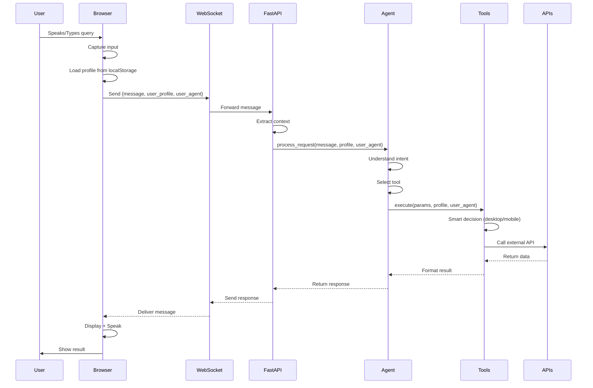
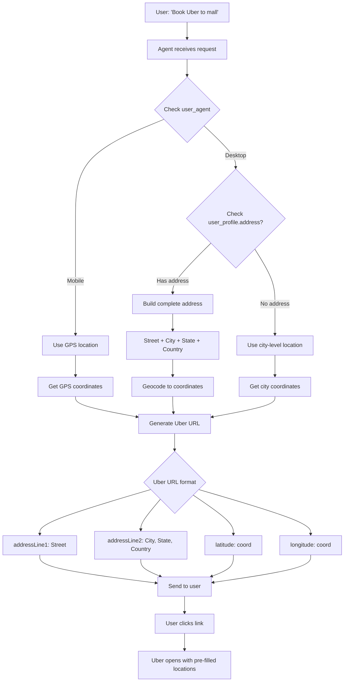

# Product Requirements Document (PRD)
# Personalized Agentic Voice Assistant

**Version:** 1.0.0  
**Date:** March 7, 2026  
**Status:** Production Ready  
**Owner:** Product Team

---

## Executive Summary

### Vision
Create an intelligent, accessible, and personalized voice assistant that seamlessly integrates AI conversation with location-aware services, enabling users to accomplish everyday tasks through natural voice interaction.

### Mission
Deliver a production-ready voice assistant that combines cutting-edge AI with practical tools for weather, dining, and transportation, while maintaining user privacy and providing a delightful user experience.

### Target Users
- **Primary**: Tech-savvy individuals seeking productivity tools
- **Secondary**: Accessibility users requiring voice-first interfaces
- **Tertiary**: Businesses needing customer service automation

---

## Table of Contents

1. [Product Overview](#1-product-overview)
2. [User Personas](#2-user-personas)
3. [User Stories](#3-user-stories)
4. [Functional Requirements](#4-functional-requirements)
5. [Non-Functional Requirements](#5-non-functional-requirements)
6. [Technical Specifications](#6-technical-specifications)
7. [User Interface](#7-user-interface)
8. [Data Flow](#8-data-flow)
9. [Security & Privacy](#9-security--privacy)
10. [Testing Strategy](#10-testing-strategy)
11. [Success Metrics](#11-success-metrics)
12. [Release Plan](#12-release-plan)
13. [Future Roadmap](#13-future-roadmap)

---

## 1. Product Overview

### 1.1 Problem Statement

**Current Pain Points:**
- Existing voice assistants lack deep integration with local services
- Limited personalization and context awareness
- Privacy concerns with cloud-based data storage
- Poor accessibility for users with disabilities
- Difficult to extend with custom capabilities

**Our Solution:**
A modular, privacy-first voice assistant that:
- Combines AI conversation with practical tools
- Learns user preferences while respecting privacy
- Provides accessible interface (WCAG AAA)
- Enables easy extension with new capabilities
- Works seamlessly across desktop and mobile

### 1.2 Value Proposition

**For End Users:**
- 🎯 **Personalized**: Learns your preferences and common destinations
- 🗣️ **Natural**: Conversational AI powered by OpenRouter/OpenAI
- 📍 **Location-Aware**: GPS-based services adapt to your location
- 🎨 **Accessible**: WCAG AAA compliant with 5 professional themes
- 🔒 **Private**: Data stored locally, you control what's shared

**For Developers:**
- 🔧 **Modular**: Easy to add new tools and capabilities
- 📚 **Well-Documented**: Comprehensive guides and examples
- 🧪 **Testable**: Clean architecture with test coverage
- 🚀 **Production-Ready**: FastAPI + React stack
- 📊 **Observable**: LangSmith integration for monitoring

**For Businesses:**
- 💼 **White-Label**: Customizable branding
- 🔌 **Extensible**: Custom tool integration
- 📈 **Scalable**: Async architecture handles load
- 🛡️ **Secure**: API key management and CORS protection
- 💰 **Cost-Effective**: Open-source base, pay for APIs used

### 1.3 Competitive Analysis

| Feature | Our Product | Alexa | Google Assistant | Siri |
|---------|-------------|-------|-----------------|------|
| Open Source | ✅ | ❌ | ❌ | ❌ |
| Local Data Storage | ✅ | ❌ | ❌ | ❌ |
| Custom Tools | ✅ Easy | ⚠️ Complex | ⚠️ Complex | ❌ |
| AI Model Choice | ✅ Any | ❌ Fixed | ❌ Fixed | ❌ Fixed |
| User Profiles | ✅ Rich | ⚠️ Basic | ⚠️ Basic | ⚠️ Basic |
| Uber Integration | ✅ Smart | ⚠️ Basic | ⚠️ Basic | ⚠️ Basic |
| Accessibility | ✅ WCAG AAA | ⚠️ AA | ⚠️ AA | ⚠️ AA |
| Multi-Theme | ✅ 5 themes | ❌ | ❌ | ❌ |
| Web-Based | ✅ | ❌ | ❌ | ❌ |
| Privacy-First | ✅ | ❌ | ❌ | ❌ |

---

## 2. User Personas

### Persona 1: "Tech-Savvy Taylor"

**Demographics:**
- Age: 28
- Occupation: Software Engineer
- Location: Urban area
- Tech proficiency: Advanced

**Goals:**
- Automate daily tasks (weather check, ride booking)
- Quick access to local information
- Customize and extend with own tools
- Privacy-conscious data handling

**Pain Points:**
- Tired of clicking through apps
- Wants voice-first workflow
- Needs integration with daily services
- Concerned about data privacy

**How Our Product Helps:**
- Voice-first interface saves time
- Direct integrations (Uber, weather, restaurants)
- Open-source, can add custom tools
- Local data storage, transparent privacy

---

### Persona 2: "Accessibility-Focused Alex"

**Demographics:**
- Age: 45
- Occupation: Accountant
- Location: Suburban area
- Tech proficiency: Moderate
- Visual impairment

**Goals:**
- Independent task completion
- Screen-reader compatible interface
- Large text and high contrast options
- Voice-controlled navigation

**Pain Points:**
- Many apps lack accessibility
- Small text, poor contrast
- Difficult keyboard navigation
- Voice assistants ignore accessibility

**How Our Product Helps:**
- WCAG AAA compliant design
- High contrast theme option
- Full keyboard navigation
- Screen reader optimized
- Voice-first interaction

---

### Persona 3: "Busy Professional Blake"

**Demographics:**
- Age: 35
- Occupation: Marketing Manager
- Location: Urban area
- Tech proficiency: Moderate

**Goals:**
- Manage schedule efficiently
- Quick decision making (weather, dining)
- Minimal app switching
- Smart automation

**Pain Points:**
- Too many apps to check
- Wastes time on simple tasks
- Forgets to check weather
- Restaurant decision paralysis

**How Our Product Helps:**
- Single interface for multiple services
- Voice queries faster than typing
- Personalized recommendations
- Learns preferences over time

---

## 3. User Stories

### Epic 1: Voice Interaction

#### Story 1.1: Push-to-Talk
**As a** user  
**I want to** hold a key to speak  
**So that** I can control when the assistant listens

**Acceptance Criteria:**
- [ ] Space bar activates microphone
- [ ] Visual indicator shows listening state
- [ ] Releasing key stops listening
- [ ] Works on all supported browsers

---

#### Story 1.2: Continuous Listening
**As a** user  
**I want to** click once to start listening  
**So that** I can speak without holding a key

**Acceptance Criteria:**
- [ ] Button toggles listening on/off
- [ ] Auto-detects when user stops speaking
- [ ] Configurable timeout (default 3s)
- [ ] Clear visual feedback

---

### Epic 2: User Profiles

#### Story 2.1: Profile Setup
**As a** new user  
**I want to** set up my profile  
**So that** I get personalized service

**Acceptance Criteria:**
- [ ] 3-step wizard on first launch
- [ ] Optional fields clearly marked
- [ ] Can skip and set up later
- [ ] Data saved to localStorage
- [ ] Profile review before completion

---

#### Story 2.2: Smart Uber Pickups
**As a** desktop user  
**I want to** use my home address for Uber pickups  
**So that** I don't have to specify it each time

**Acceptance Criteria:**
- [ ] Profile includes street address field
- [ ] Desktop: uses home address as default pickup
- [ ] Mobile: uses GPS location (ignores profile)
- [ ] Falls back to city if address not set
- [ ] User can override with explicit pickup

---

### Epic 3: Location Services

#### Story 3.1: Weather Check
**As a** user  
**I want to** ask about weather  
**So that** I can plan my day

**Acceptance Criteria:**
- [ ] Responds to "What's the weather?"
- [ ] Uses user's current location
- [ ] Shows current conditions + forecast
- [ ] Includes temperature, conditions, precipitation
- [ ] Updates when location changes

---

#### Story 3.2: Restaurant Search
**As a** user  
**I want to** find nearby restaurants  
**So that** I can decide where to eat

**Acceptance Criteria:**
- [ ] Searches by cuisine type
- [ ] Shows ratings and distance
- [ ] Supports location specification
- [ ] Returns top 5 results
- [ ] Includes address and links

---

#### Story 3.3: Uber Booking
**As a** user  
**I want to** book an Uber  
**So that** I can get a ride quickly

**Acceptance Criteria:**
- [ ] Generates working Uber deep link
- [ ] Pre-fills pickup based on device type
- [ ] Pre-fills destination from query
- [ ] Shows estimated pickup location
- [ ] Opens Uber app/web with one click

---

### Epic 4: Personalization

#### Story 4.1: Activity Tracking
**As a** user  
**I want** my activity tracked  
**So that** I get better recommendations

**Acceptance Criteria:**
- [ ] Tracks restaurant visits
- [ ] Tracks Uber destinations
- [ ] Learns favorite cuisines
- [ ] Suggests frequent destinations
- [ ] Never shares without permission

---

#### Story 4.2: Personalized Greetings
**As a** user  
**I want** personalized greetings  
**So that** the experience feels tailored to me

**Acceptance Criteria:**
- [ ] Uses name and title
- [ ] Time-aware (morning/afternoon/evening)
- [ ] Mentions location
- [ ] Rotates greeting styles
- [ ] Can be disabled in settings

---

### Epic 5: Accessibility

#### Story 5.1: Theme Selection
**As a** user with visual needs  
**I want to** choose a high-contrast theme  
**So that** I can read the interface easily

**Acceptance Criteria:**
- [ ] 5 theme options
- [ ] High Contrast theme (WCAG AAA)
- [ ] Theme persists across sessions
- [ ] No flash when changing themes
- [ ] Works with system preferences

---

#### Story 5.2: Keyboard Navigation
**As a** keyboard user  
**I want to** navigate without a mouse  
**So that** I can use the app efficiently

**Acceptance Criteria:**
- [ ] Tab navigation works throughout
- [ ] Space bar for push-to-talk
- [ ] Enter to send text messages
- [ ] Escape to close modals
- [ ] Visual focus indicators

---

## 4. Functional Requirements

### 4.1 Core Features

#### FR-1: Voice Recognition
- **FR-1.1**: System MUST support Web Speech API
- **FR-1.2**: System MUST detect speech start/end automatically
- **FR-1.3**: System MUST provide visual feedback during listening
- **FR-1.4**: System MUST support push-to-talk mode (Space bar)
- **FR-1.5**: System MUST support continuous listening mode
- **FR-1.6**: System MUST gracefully degrade if voice unsupported

#### FR-2: AI Conversation
- **FR-2.1**: System MUST integrate with OpenRouter or OpenAI
- **FR-2.2**: System MUST maintain conversation context
- **FR-2.3**: System MUST support multi-turn dialogues
- **FR-2.4**: System MUST use LangChain for agent orchestration
- **FR-2.5**: System MUST log conversations to LangSmith (if enabled)
- **FR-2.6**: System MUST handle API failures gracefully

#### FR-3: Location Services
- **FR-3.1**: System MUST detect user's GPS location
- **FR-3.2**: System MUST geocode addresses to coordinates
- **FR-3.3**: System MUST reverse geocode coordinates to addresses
- **FR-3.4**: System MUST cache geocoding results
- **FR-3.5**: System MUST fall back to default location if GPS fails
- **FR-3.6**: System MUST update location context automatically

#### FR-4: Weather Tool
- **FR-4.1**: System MUST fetch current weather conditions
- **FR-4.2**: System MUST provide temperature, conditions, humidity
- **FR-4.3**: System MUST support location specification
- **FR-4.4**: System MUST use Open-Meteo API (no key required)
- **FR-4.5**: System MUST handle API rate limits
- **FR-4.6**: System MUST cache weather data (5-minute TTL)

#### FR-5: Restaurant Tool
- **FR-5.1**: System MUST search restaurants by cuisine
- **FR-5.2**: System MUST filter by location
- **FR-5.3**: System MUST return ratings and reviews
- **FR-5.4**: System MUST integrate with Zomato API
- **FR-5.5**: System MUST handle missing API key gracefully
- **FR-5.6**: System MUST sort results by relevance/rating

#### FR-6: Uber Tool
- **FR-6.1**: System MUST generate Uber deep links
- **FR-6.2**: System MUST detect device type (desktop/mobile)
- **FR-6.3**: System MUST use profile address for desktop pickup
- **FR-6.4**: System MUST use GPS location for mobile pickup
- **FR-6.5**: System MUST build complete address (street+city+state+country)
- **FR-6.6**: System MUST pre-fill pickup and dropoff in Uber
- **FR-6.7**: System MUST geocode pickup address to coordinates
- **FR-6.8**: System MUST handle geocoding failures gracefully

#### FR-7: User Profiles
- **FR-7.1**: System MUST collect basic information (name, age, gender)
- **FR-7.2**: System MUST collect location (address, city, state, country)
- **FR-7.3**: System MUST store profile in localStorage
- **FR-7.4**: System MUST support profile editing
- **FR-7.5**: System MUST support profile reset
- **FR-7.6**: System MUST auto-assign titles based on gender/age
- **FR-7.7**: System MUST generate personalized greetings
- **FR-7.8**: System MUST track activity (restaurants, Uber trips)

#### FR-8: User Interface
- **FR-8.1**: System MUST provide 5 theme options
- **FR-8.2**: System MUST support dark and light modes
- **FR-8.3**: System MUST persist theme selection
- **FR-8.4**: System MUST show connection status
- **FR-8.5**: System MUST show processing status
- **FR-8.6**: System MUST display conversation history
- **FR-8.7**: System MUST support text input fallback
- **FR-8.8**: System MUST show voice visualization

---

### 4.2 User Profile Requirements

#### Profile Data Structure
```typescript
{
  // Basic Info (Required)
  id: string,
  firstName: string,
  createdAt: Date,
  lastUpdatedAt: Date,
  
  // Personal (Optional)
  lastName?: string,
  gender: 'male' | 'female' | 'other' | 'prefer-not-to-say',
  age?: number,
  title?: 'Mr.' | 'Mrs.' | 'Ms.' | 'Miss' | 'Dr.' | 'Master' | '',
  
  // Location (Optional)
  address?: string,  // Street address
  city: string,      // Required for services
  state: string,
  country: string,
  
  // Preferences (Auto-generated)
  preferences: {
    favoriteRestaurants: Array<RestaurantVisit>,
    frequentDestinations: Array<UberTrip>,
    preferredCuisines: Array<string>
  }
}
```

#### Profile Setup Flow
```
First Launch
    ↓
Show Profile Setup Wizard
    ↓
Step 1: Name
    ↓
Step 2: Gender, Age, Title
    ↓
Step 3: Address, City, State, Country
    ↓
Save to localStorage
    ↓
Show Main App
```

---

### 4.3 Smart Pickup Logic

#### Desktop Flow
```
User requests Uber
    ↓
Detect: User-Agent indicates desktop
    ↓
Check: user_profile.address exists?
    ├─ YES → Build complete address
    │         (street + city + state + country)
    │         ↓
    │         Geocode address
    │         ↓
    │         Use coordinates as pickup
    │
    └─ NO → Use system location (city-level)
               ↓
               Use city coordinates as pickup
```

#### Mobile Flow
```
User requests Uber
    ↓
Detect: User-Agent indicates mobile
    ↓
Get current GPS location
    ↓
Use GPS coordinates as pickup
(Ignore profile address)
```

---

## 5. Non-Functional Requirements

### 5.1 Performance

**NFR-1: Response Time**
- Voice recognition latency: <500ms
- AI response generation: <3s (95th percentile)
- Weather API response: <1s
- Restaurant search: <2s
- Uber link generation: <500ms
- UI interactions: <100ms

**NFR-2: Throughput**
- Concurrent users: 100+ per server instance
- WebSocket connections: 1000+ simultaneous
- Messages per second: 50+ per server

**NFR-3: Resource Usage**
- Backend memory: <512MB baseline
- Frontend bundle size: <500KB gzipped
- API calls cached: 90% cache hit rate
- Database queries: None (localStorage only)

---

### 5.2 Scalability

**NFR-4: Horizontal Scaling**
- Backend: Stateless, can scale to N instances
- Load balancer: Round-robin distribution
- WebSocket: Sticky sessions supported
- Session management: In-memory (future: Redis)

**NFR-5: Data Growth**
- Profile data: <1MB per user
- Conversation history: Ephemeral (not persisted)
- Cache size: Auto-pruning at 1000 entries

---

### 5.3 Reliability

**NFR-6: Availability**
- Uptime target: 99.5% (SLA)
- Planned downtime: <4 hours/month
- Unplanned downtime: <1 hour/month

**NFR-7: Error Handling**
- API failures: Graceful degradation
- Network errors: Retry with exponential backoff
- Invalid inputs: Clear error messages
- Crash recovery: Auto-reconnect WebSocket

**NFR-8: Data Integrity**
- Profile data: localStorage with validation
- Conversation context: Maintained per session
- No data loss on browser refresh

---

### 5.4 Security

**NFR-9: Authentication**
- API keys: Environment variables only
- User data: No server-side authentication (v1.0)
- WebSocket: Session ID validation
- CORS: Whitelist configuration

**NFR-10: Data Protection**
- API keys: Never exposed to client
- User profile: Stored locally, user-controlled
- Conversation: Not persisted by default
- HTTPS: Required in production

**NFR-11: Input Validation**
- All user inputs sanitized
- API responses validated
- Type checking (TypeScript)
- SQL injection: N/A (no database)

---

### 5.5 Accessibility

**NFR-12: WCAG Compliance**
- Level: AAA target, AA minimum
- Color contrast: 7:1 minimum (AAA)
- Keyboard navigation: Full support
- Screen readers: ARIA labels throughout
- Focus indicators: Visible and clear

**NFR-13: Browser Support**
- Chrome: Latest 2 versions
- Edge: Latest 2 versions
- Firefox: Latest 2 versions
- Safari: Latest 2 versions
- Mobile: iOS Safari 14+, Chrome Android 90+

**NFR-14: Device Support**
- Desktop: 1024px+ width
- Tablet: 768px-1023px width
- Mobile: 320px-767px width
- Touch: Full gesture support
- Voice: Required for voice features

---

### 5.6 Usability

**NFR-15: User Experience**
- Learning curve: <5 minutes to first success
- Task completion: <30 seconds for common tasks
- Error recovery: Clear guidance provided
- Feedback: Always visible and timely

**NFR-16: Documentation**
- User guide: Comprehensive and illustrated
- Developer docs: API references and examples
- Inline help: Tooltips and hints
- Error messages: Actionable and clear

---

### 5.7 Maintainability

**NFR-17: Code Quality**
- Test coverage: >80%
- Code style: Enforced (Black, ESLint)
- Type safety: 100% TypeScript frontend
- Documentation: Docstrings and JSDoc

**NFR-18: Monitoring**
- Logging: Structured logs (JSON)
- Metrics: Response times, error rates
- Tracing: LangSmith integration
- Alerts: Critical errors notify team

---

## 6. Technical Specifications

### 6.1 Backend Architecture

**Tech Stack:**
- **Language**: Python 3.9+
- **Framework**: FastAPI 0.104+
- **AI Framework**: LangChain 0.1+
- **AI Provider**: OpenRouter or OpenAI
- **WebSocket**: FastAPI native WebSockets
- **Geocoding**: Geopy with Nominatim
- **HTTP Client**: httpx (async)

**Key Libraries:**
```python
fastapi>=0.104.0
langchain>=0.1.0
geopy>=2.4.0
httpx>=0.25.0
python-dotenv>=1.0.0
pydantic>=2.0.0
```

**Project Structure:**
```
src/
├── agent/
│   ├── core.py          # Main agent class
│   └── prompts.py       # System prompts
├── services/
│   ├── context.py       # Context management
│   └── location.py      # Location services
├── tools/
│   ├── base.py          # Base tool class
│   ├── weather.py       # Weather tool
│   ├── zomato.py        # Restaurant tool
│   └── uber.py          # Uber tool
└── utils/
    └── device_detection.py
```

---

### 6.2 Frontend Architecture

**Tech Stack:**
- **Framework**: React 18.2+
- **Language**: TypeScript 5.0+
- **Build Tool**: Vite 5.0+
- **State Management**: React Hooks
- **API Client**: Native WebSocket + Fetch
- **Speech**: Web Speech API

**Key Libraries:**
```json
{
  "react": "^18.2.0",
  "react-dom": "^18.2.0",
  "typescript": "^5.0.0",
  "vite": "^5.0.0"
}
```

**Project Structure:**
```
ui/src/
├── components/
│   ├── ProfileSetup/
│   │   ├── ProfileSetup.tsx
│   │   └── ProfileSetup.css
│   └── ProfileSettings/
│       ├── ProfileSettings.tsx
│       └── ProfileSettings.css
├── hooks/
│   ├── useVoiceAssistant.ts
│   └── useUserProfile.ts
├── api/
│   └── client.ts
├── types/
│   └── userProfile.ts
├── App.tsx
└── main.tsx
```

---

### 6.3 Data Models

#### User Profile Model
```typescript
interface UserProfile {
  id: string;
  firstName: string;
  lastName?: string;
  gender: Gender;
  age?: number;
  title: Title;
  address?: string;
  city: string;
  state: string;
  country: string;
  createdAt: Date;
  lastUpdatedAt: Date;
}

type Gender = 'male' | 'female' | 'other' | 'prefer-not-to-say';
type Title = 'Mr.' | 'Mrs.' | 'Ms.' | 'Miss' | 'Dr.' | 'Master' | '';
```

#### WebSocket Message Model
```typescript
interface Message {
  type: 'chat' | 'status' | 'response' | 'error' | 'pong';
  message?: string;
  status?: 'processing' | 'listening' | 'speaking';
  success?: boolean;
  user_profile?: UserProfile;
  user_agent?: string;
  timestamp?: number;
}
```

#### Location Model
```python
@dataclass
class Location:
    latitude: float
    longitude: float
    address: str
    city: str
    state: str
    country: str
```

---

### 6.4 API Specifications

#### WebSocket API

**Endpoint:** `ws://localhost:8000/ws/{session_id}`

**Client → Server:**
```json
{
  "type": "chat",
  "message": "What's the weather?",
  "user_profile": {
    "id": "user_123",
    "firstName": "John",
    "address": "123 Main St",
    "city": "Erie",
    "state": "PA"
  },
  "user_agent": "Mozilla/5.0...",
  "timestamp": 1234567890
}
```

**Server → Client:**
```json
{
  "type": "response",
  "message": "The weather in Erie is...",
  "success": true
}
```

#### External APIs

**Weather (Open-Meteo):**
```
GET https://api.open-meteo.com/v1/forecast
?latitude={lat}
&longitude={lon}
&current_weather=true
```

**Restaurants (Zomato):**
```
GET https://developers.zomato.com/api/v2.1/search
?lat={lat}
&lon={lon}
&cuisines={cuisine}
&count=5
Headers: user-key: {ZOMATO_API_KEY}
```

**Uber (Deep Links):**
```
https://m.uber.com/go/product-selection
?pickup={JSON}
&drop[0]={JSON}
```

---

## 7. User Interface

### 7.1 Wireframes

#### Main Screen
```
┌─────────────────────────────────────────────────┐
│  Voice Assistant              [Theme ▼] [⚙️]    │
├─────────────────────────────────────────────────┤
│                                                 │
│  [Status: Connected ●]                          │
│                                                 │
│  ┌─────────────────────────────────────────┐  │
│  │ User: What's the weather?               │  │
│  │                                         │  │
│  │ Assistant: Currently 72°F and sunny... │  │
│  │                                         │  │
│  │ User: Find pizza places                │  │
│  │                                         │  │
│  │ Assistant: Here are 5 pizza places...  │  │
│  └─────────────────────────────────────────┘  │
│                                                 │
│  [~~~~~Voice Waveform~~~~~]                    │
│                                                 │
│  ┌─────────────────────────────────────────┐  │
│  │ Type a message...                    [↑]│  │
│  └─────────────────────────────────────────┘  │
│                                                 │
│  [🎤] Push to talk (hold Space)                │
│                                                 │
└─────────────────────────────────────────────────┘
```

#### Profile Setup
```
┌─────────────────────────────────────────────────┐
│  Welcome! Let's set up your profile             │
│                                                 │
│  Step 1 of 3                                   │
│  [━━━━━━━━━━          ]                         │
│                                                 │
│  What's your name?                             │
│                                                 │
│  First Name *                                   │
│  [John                              ]          │
│                                                 │
│  Last Name (optional)                          │
│  [Doe                               ]          │
│                                                 │
│                                                 │
│                    [Skip]  [Next →]            │
└─────────────────────────────────────────────────┘
```

---

### 7.2 Themes

#### Light Theme
- Background: #FFFFFF
- Text: #1A1A1A
- Primary: #4A90E2
- Accent: #50C878

#### Dark Theme
- Background: #1A1A1A
- Text: #FFFFFF
- Primary: #4A90E2
- Accent: #50C878

#### Nord Theme
- Background: #2E3440
- Text: #ECEFF4
- Primary: #88C0D0
- Accent: #A3BE8C

#### Solarized Theme
- Background: #002B36
- Text: #93A1A1
- Primary: #268BD2
- Accent: #2AA198

#### High Contrast Theme (WCAG AAA)
- Background: #000000
- Text: #FFFFFF
- Primary: #FFD700
- Accent: #00FF00
- Contrast Ratio: 21:1

---

## 8. Data Flow

### 8.1 Complete Flow Diagram



---

### 8.2 Uber Smart Pickup Flow



---

## 9. Security & Privacy

### 9.1 Data Privacy

**Local Storage Only:**
- User profile stored in browser localStorage
- No server-side user database
- User controls all data
- Can export/delete anytime

**Data Minimization:**
- Collect only necessary information
- Optional fields clearly marked
- No tracking cookies
- No analytics by default

**Data Transmission:**
- User profile sent only during conversations
- Transmitted over WebSocket (TLS in production)
- Not logged by default
- Ephemeral (not persisted on server)

---

### 9.2 API Key Security

**Backend:**
- API keys in environment variables
- Never committed to version control
- Never exposed to client
- Rotated regularly

**Frontend:**
- No API keys in frontend code
- All API calls through backend
- CORS protection enabled
- XSS prevention

---

### 9.3 Threat Model

**Threats:**
1. API key exposure → Unauthorized usage
2. XSS attacks → Data theft
3. CSRF attacks → Unauthorized actions
4. Man-in-the-middle → Data interception
5. DDoS → Service disruption

**Mitigations:**
1. Environment variables, .gitignore
2. Input sanitization, CSP headers
3. CORS configuration, token validation
4. HTTPS in production
5. Rate limiting, WAF (future)

---

## 10. Testing Strategy

### 10.1 Unit Tests

**Backend:**
- Tool execution logic
- Agent decision making
- Context management
- Geocoding service
- Device detection

**Frontend:**
- Component rendering
- Hook behavior
- Profile management
- WebSocket client
- Voice recognition

**Coverage Target:** 80%

---

### 10.2 Integration Tests

**End-to-End Flows:**
- Voice input → AI response
- Profile setup → Data persistence
- Desktop Uber → Address usage
- Mobile Uber → GPS usage
- Theme change → Persistence

**API Integration:**
- Weather API calls
- Zomato API calls
- Geocoding service
- OpenRouter/OpenAI

---

### 10.3 User Acceptance Testing

**Test Scenarios:**
1. New user completes profile setup
2. User asks about weather
3. User finds restaurants
4. Desktop user books Uber (uses home address)
5. Mobile user books Uber (uses GPS)
6. User changes theme
7. User edits profile
8. User resets data

**Success Criteria:**
- 100% scenario completion
- <5 minutes per scenario
- No critical bugs
- Positive user feedback

---

## 11. Success Metrics

### 11.1 Key Performance Indicators (KPIs)

**User Engagement:**
- Daily active users (DAU)
- Messages per session
- Session duration
- Return rate (D7, D30)

**Feature Adoption:**
- Profile completion rate: >80%
- Voice usage rate: >60%
- Tool usage distribution:
  - Weather: 40%
  - Restaurants: 30%
  - Uber: 20%
  - Other: 10%

**Technical Metrics:**
- API response time: <3s (p95)
- Error rate: <1%
- Uptime: >99.5%
- WebSocket reconnects: <5%

**User Satisfaction:**
- Task completion rate: >90%
- User satisfaction score: >4/5
- Net Promoter Score: >40
- Feature request volume

---

### 11.2 Success Criteria

**Launch (v1.0):**
- ✅ All core features working
- ✅ Test coverage >80%
- ✅ Documentation complete
- ✅ Zero critical bugs
- ✅ Accessibility WCAG AA minimum

**3 Months Post-Launch:**
- 1000+ total users
- 50+ daily active users
- <2s average response time
- >95% uptime
- >4.0 user rating

**6 Months Post-Launch:**
- 5000+ total users
- 200+ daily active users
- Feature parity with major assistants
- Mobile apps launched (iOS/Android)
- Enterprise customers

---

## 12. Release Plan

### 12.1 Version 1.0 (Current)

**Status:** Production Ready  
**Release Date:** March 2026

**Features:**
- ✅ Voice recognition (push-to-talk + continuous)
- ✅ AI conversation (OpenRouter/OpenAI)
- ✅ User profiles with personalization
- ✅ Weather tool
- ✅ Restaurant search (Zomato)
- ✅ Uber booking (smart pickup)
- ✅ 5 professional themes
- ✅ WCAG AA accessibility
- ✅ WebSocket real-time communication
- ✅ LangSmith monitoring

---

### 12.2 Version 1.1 (Q2 2026)

**Planned Features:**
- [ ] Multi-language support (Spanish, French, German)
- [ ] Calendar integration (Google Calendar)
- [ ] Email tool (send/read)
- [ ] Custom wake word ("Hey Assistant")
- [ ] Voice profiles (multi-user)
- [ ] Export conversation history
- [ ] Improved error recovery
- [ ] Additional themes

---

### 12.3 Version 2.0 (Q3 2026)

**Major Features:**
- [ ] Mobile apps (iOS/Android native)
- [ ] Smart home integration (Philips Hue, Nest)
- [ ] Music control (Spotify, Apple Music)
- [ ] News briefing
- [ ] Shopping list management
- [ ] Reminder system
- [ ] Offline mode (cached responses)
- [ ] Progressive Web App (PWA)

---

### 12.4 Version 3.0 (Q4 2026)

**Enterprise Features:**
- [ ] Custom AI model training
- [ ] Plugin marketplace
- [ ] Team collaboration
- [ ] Admin dashboard
- [ ] Usage analytics
- [ ] White-label options
- [ ] On-premise deployment
- [ ] SSO integration

---

## 13. Future Roadmap

### 13.1 Short-Term (3-6 months)

**User-Facing:**
- Multi-language support
- More integrations (calendar, email)
- Voice customization
- Improved personalization

**Technical:**
- Performance optimization
- Better error handling
- Enhanced monitoring
- Automated testing

---

### 13.2 Medium-Term (6-12 months)

**User-Facing:**
- Native mobile apps
- Smart home control
- Media playback
- Proactive suggestions

**Technical:**
- Microservices architecture
- Redis for session management
- PostgreSQL for analytics
- Kubernetes deployment

---

### 13.3 Long-Term (12+ months)

**User-Facing:**
- Custom wake words
- Emotion detection
- Context-aware suggestions
- Marketplace for plugins

**Technical:**
- Edge deployment
- Custom AI models
- Blockchain for privacy
- Federated learning

---

## 14. Appendices

### Appendix A: Glossary

- **Agent**: AI system that uses tools to accomplish tasks
- **Tool**: Function that the agent can call (weather, Uber, etc.)
- **Profile**: User's personal information and preferences
- **Session**: Single conversation instance
- **Context**: Information about current state (location, conversation history)
- **Geocoding**: Converting address to coordinates
- **Deep Link**: URL that opens app with pre-filled data
- **WCAG**: Web Content Accessibility Guidelines
- **TTL**: Time To Live (cache duration)

---

### Appendix B: References

**Technical Documentation:**
- FastAPI: https://fastapi.tiangolo.com
- LangChain: https://docs.langchain.com
- React: https://react.dev
- Web Speech API: https://developer.mozilla.org/en-US/docs/Web/API/Web_Speech_API

**APIs:**
- OpenRouter: https://openrouter.ai/docs
- Open-Meteo: https://open-meteo.com/en/docs
- Zomato: https://developers.zomato.com/documentation
- Nominatim: https://nominatim.org/release-docs/latest/api/Overview/

**Standards:**
- WCAG 2.1: https://www.w3.org/WAI/WCAG21/quickref/
- WebSocket Protocol: https://datatracker.ietf.org/doc/html/rfc6455

---

### Appendix C: Change Log

**v1.0.0 (March 2026)**
- Initial production release
- All core features implemented
- Smart Uber pickup (desktop/mobile aware)
- Complete address building fix
- User profile with address field
- React Ref fix for profile data flow

**v0.9.0 (February 2026)**
- Beta release
- Profile system added
- Theme selector implemented
- Accessibility improvements

**v0.5.0 (January 2026)**
- Alpha release
- Basic voice recognition
- Weather and restaurant tools
- Initial UI

---

**Document Version:** 1.0.0  
**Last Updated:** March 7, 2026  
**Next Review:** June 2026

---

**Approval Signatures:**

Product Manager: ________________  
Engineering Lead: ________________  
Design Lead: ________________  
QA Lead: ________________
